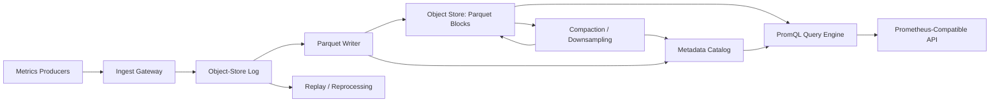
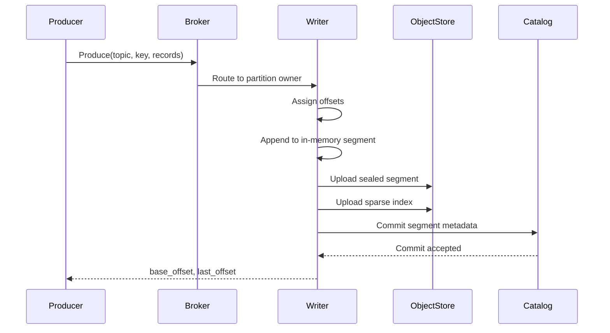
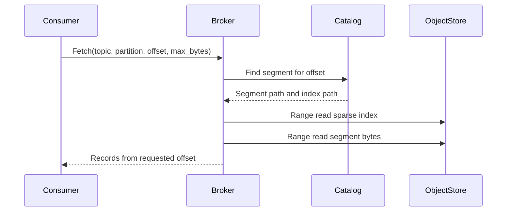

# Metrics Collection Architecture

This document describes a mostly stateless metrics collection system with a
PromQL query interface, Parquet data stored in cloud object storage, and a
Kafka-style append log built on top of object storage.

The system is organized around two durable storage layers:

1. An object-store-backed log for ingest buffering and replay.
2. Object-store-backed Parquet blocks for efficient analytical and PromQL reads.

Compute services are intended to be horizontally scalable and disposable. Durable
state lives in object storage, a metadata catalog, and optionally a managed cache.

## Goals

- Expose Prometheus-compatible query APIs using PromQL.
- Ingest metrics through Prometheus remote-write and related protocols.
- Store long-lived metric data as Parquet in object storage.
- Keep compute nodes as stateless as practical.
- Support replay, backpressure, compaction, retention, and reprocessing.
- Avoid local durable disks as a core system dependency.
- Keep the design cloud-portable across S3, GCS, Azure Blob, and compatible stores.

## Non-Goals

- Full Kafka wire-protocol compatibility in the first version.
- Sub-10ms Kafka-style produce and consume latency.
- Full PromQL semantic coverage in the MVP.
- Exactly-once end-to-end processing in the first version.
- Object-store-only operation without a metadata/index service.

## High-Level System



The ingest path and query path are decoupled by the object-store log. Raw metric
events are first committed to an append log, then asynchronously transformed into
query-optimized Parquet blocks.

## Major Components

### Ingest Gateway

The ingest gateway accepts metric writes from producers.

Supported input protocols should include:

- Prometheus remote-write.
- OpenTelemetry metrics.
- Optional custom HTTP/gRPC batch API.

Responsibilities:

- Authenticate tenants.
- Validate labels, metric names, timestamps, and sample values.
- Enforce per-tenant limits.
- Normalize incoming batches.
- Route records into the object-store log.

The ingest gateway should be stateless. It should not write Parquet directly.

### Object-Store Log

The object-store log is the durable ingestion buffer. It provides Kafka-like
topic, partition, offset, fetch, and consumer offset concepts, while storing the
actual log bytes in immutable objects.

This layer gives the metrics system:

- Durable buffering.
- Replay for failed processors.
- Reprocessing when the Parquet schema or writer changes.
- Backpressure isolation between ingestion and storage compaction.
- A clean boundary between raw input events and optimized metric blocks.

### Parquet Writer

Parquet writer workers consume raw records from the log and create immutable
Parquet blocks in object storage.

They maintain only short-lived in-memory state while batching records. On flush,
they write a new object and commit metadata to the catalog.

### Metadata Catalog

The metadata catalog is the control plane for storage discovery and indexing.
Object storage is the source of truth for bytes, but the catalog is the source of
truth for where useful data lives.

The catalog tracks:

- Topics and log partitions.
- Log segments and offset ranges.
- Consumer offsets.
- Metric series metadata.
- Label indexes.
- Parquet block manifests.
- Compaction state.
- Retention state.

For an MVP, Postgres is a good catalog backend. For larger scale, DynamoDB,
FoundationDB, Spanner, Bigtable, or a lakehouse catalog can be considered.

### PromQL Query Engine

The query engine exposes Prometheus-compatible APIs and evaluates PromQL over
Parquet-backed metric data.

Responsibilities:

- Parse PromQL.
- Extract metric selectors and time ranges.
- Resolve candidate series through the catalog.
- Resolve candidate Parquet blocks through block metadata.
- Read only necessary Parquet columns and row groups.
- Reconstruct time series by series ID.
- Execute PromQL functions and aggregations.
- Return Prometheus-compatible JSON responses.

The query engine should be stateless. Caches may be added, but cached data should
be disposable.

## Object-Store Log Architecture

### Data Model

The log follows Kafka-like concepts:

- Topic: named stream of records.
- Partition: ordered shard within a topic.
- Offset: monotonically increasing record position within a partition.
- Segment: immutable object containing a contiguous offset range.
- Consumer group: named group tracking committed offsets.

Example topic:

```text
metrics-raw
```

Example object layout:

```text
s3://metrics-bucket/logs/
  topic=metrics-raw/
    partition=000000/
      segment-00000000000000000000.log
      index-00000000000000000000.idx
      segment-00000000000001000000.log
      index-00000000000001000000.idx
```

### Segment Format

Segments should use a binary record-batch format rather than Parquet. The log is
optimized for append and replay, while Parquet is optimized for query.

Segment structure:

```text
segment_header
record_batch[]
segment_footer
```

Record batch structure:

```text
base_offset
record_count
min_timestamp
max_timestamp
compression
uncompressed_size
compressed_payload
crc
```

Record structure:

```text
offset_delta
timestamp_delta
key
headers
value
```

Recommended compression:

- zstd by default.
- lz4 where lower latency matters more than compression ratio.

### Sparse Index

Each segment should have a sparse index that maps offsets to byte positions.

```text
relative_offset -> byte_position
```

Fetch by offset uses the index to find the closest lower offset, then performs an
object-store range read and decodes forward.

### Write Path



Only committed segments are visible to consumers. The high watermark advances
after segment metadata is committed.

### Read Path



Read brokers may cache segment metadata, indexes, and hot byte ranges. Caches are
optional and disposable.

### Writer Ownership

Each partition has a single active writer lease.

Lease metadata:

```text
topic
partition_id
owner_id
lease_epoch
lease_expires_at
```

Writers renew leases periodically. Segment commits include the lease epoch, and
the catalog rejects stale epochs. This prevents split-brain appends.

### Fresh Data Strategy

Object storage is not efficient for tiny appends. The MVP should use
micro-segments:

- Flush every 1 to 5 seconds.
- Flush when buffered data reaches 16 to 64 MB.
- Compact small segments later.

This accepts a few seconds of visibility latency in exchange for a simpler and
more stateless design.

### Log Metadata Tables

Minimal schema:

```sql
create table topics (
    topic text primary key,
    partition_count integer not null,
    retention_ms bigint not null,
    created_at timestamptz not null
);

create table partitions (
    topic text not null,
    partition_id integer not null,
    log_start_offset bigint not null,
    high_watermark bigint not null,
    next_offset bigint not null,
    leader_owner text,
    lease_epoch bigint not null,
    lease_expires_at timestamptz,
    primary key (topic, partition_id)
);

create table log_segments (
    topic text not null,
    partition_id integer not null,
    start_offset bigint not null,
    end_offset bigint not null,
    object_path text not null,
    index_path text not null,
    size_bytes bigint not null,
    record_count bigint not null,
    min_timestamp_ms bigint not null,
    max_timestamp_ms bigint not null,
    checksum text not null,
    state text not null,
    created_at timestamptz not null,
    primary key (topic, partition_id, start_offset)
);

create table consumer_offsets (
    group_id text not null,
    topic text not null,
    partition_id integer not null,
    committed_offset bigint not null,
    generation_id bigint not null,
    updated_at timestamptz not null,
    primary key (group_id, topic, partition_id)
);
```

## Metrics Storage Architecture

### Raw Input Record

The log record value should preserve the original metric batch where practical,
for example a Prometheus remote-write protobuf payload or normalized equivalent.

Logical sample model:

```text
tenant_id
metric_name
labels
timestamp_ms
value
```

### Series Identity

Each unique metric name plus label set becomes a series.

```text
series_id = hash(tenant_id, metric_name, canonical_sorted_labels)
```

Canonical labels must be sorted and encoded deterministically.

### Parquet Schema

The recommended MVP schema is simple and query-friendly:

```text
tenant_id string
metric_name string
series_id string
timestamp_ms int64
value double
```

This repeats `metric_name` in sample files to improve pruning and debugging. A
later version can split series metadata and samples more aggressively:

Series metadata:

```text
tenant_id
series_id
metric_name
labels
first_seen_ms
last_seen_ms
```

Samples:

```text
tenant_id
series_id
timestamp_ms
value
```

### Parquet Object Layout

Recommended layout:

```text
s3://metrics-bucket/parquet/
  tenant=acme/
    day=2026-04-26/
      hour=13/
        shard=000/
          samples-1714140000-1714140300-l0-uuid.parquet
        shard=001/
          samples-1714140000-1714140300-l0-uuid.parquet
```

Avoid partitioning too deeply by metric name because high-cardinality metric
names can create many tiny files. Use catalog indexes and Parquet statistics for
pruning.

### Block Metadata

Every Parquet block should have a catalog record:

```text
tenant_id
block_id
object_path
min_time_ms
max_time_ms
shard_id
level
sample_count
series_count
size_bytes
created_at
state
```

Optional block summaries:

```text
metric_names
label_keys
min_series_id
max_series_id
```

### Series and Label Indexes

PromQL selectors require fast label matching. The MVP should keep a relational
or key-value inverted index.

Series table:

```sql
create table metric_series (
    tenant_id text not null,
    series_id text not null,
    metric_name text not null,
    labels_json jsonb not null,
    first_seen_ms bigint not null,
    last_seen_ms bigint not null,
    primary key (tenant_id, series_id)
);
```

Label index:

```sql
create table metric_label_index (
    tenant_id text not null,
    metric_name text not null,
    label_name text not null,
    label_value text not null,
    series_id text not null,
    primary key (
        tenant_id,
        metric_name,
        label_name,
        label_value,
        series_id
    )
);
```

Block table:

```sql
create table metric_blocks (
    tenant_id text not null,
    block_id text not null,
    object_path text not null,
    min_time_ms bigint not null,
    max_time_ms bigint not null,
    shard_id integer not null,
    level integer not null,
    sample_count bigint not null,
    series_count bigint not null,
    size_bytes bigint not null,
    state text not null,
    created_at timestamptz not null,
    primary key (tenant_id, block_id)
);
```

## PromQL Query Flow

For a query like:

```promql
rate(http_requests_total{job="api", region="us-east-1"}[5m])
```

The query engine:

1. Parses the PromQL expression.
2. Extracts the metric selector and range.
3. Expands the query time range by the required lookback window.
4. Resolves matching `series_id` values through the label index.
5. Resolves candidate Parquet blocks by tenant and time range.
6. Applies metric and series pruning.
7. Reads required Parquet columns using object-store range reads.
8. Groups samples by series.
9. Evaluates PromQL functions and aggregations.
10. Returns Prometheus-compatible JSON.

Initial API endpoints:

```text
/api/v1/query
/api/v1/query_range
/api/v1/series
/api/v1/labels
/api/v1/label/:name/values
```

## Compaction

The system needs two compaction loops.

### Log Segment Compaction

Log segment compaction merges small immutable log segments into larger segments.

Example:

```text
0-999
1000-1999
2000-2999
```

becomes:

```text
0-2999
```

Old segments should be marked obsolete and deleted after a grace period.

### Metric Block Compaction

Metric block compaction merges small Parquet files into larger sorted files.

Recommended levels:

```text
L0: fresh small blocks
L1: 5-minute or 15-minute blocks
L2: hourly blocks
L3: daily blocks for older data
```

Recommended target sizes:

```text
L0: 32-128 MB
L1/L2: 256-512 MB
L3: 512 MB-1 GB
```

Sort compacted Parquet data by:

```text
series_id, timestamp_ms
```

or:

```text
metric_name, series_id, timestamp_ms
```

## Downsampling

Long-range PromQL over raw samples can be expensive. Background jobs should
create lower-resolution blocks:

```text
raw samples
5-minute aggregates
1-hour aggregates
```

Useful aggregate columns:

```text
min
max
sum
count
avg
last
counter_reset_count
```

Query planning can choose downsampled data for long dashboard ranges where exact
sample-level fidelity is not required.

## Retention

Retention is enforced through catalog state and object-store lifecycle policies.

Example policy:

```text
raw log records: 3-7 days
raw metric samples: 15-30 days
5-minute downsampled data: 180 days
1-hour downsampled data: 2 years
```

Deletion flow:

1. Mark expired catalog entries as pending deletion.
2. Delete objects from storage.
3. Mark catalog entries deleted.
4. Periodically vacuum deleted metadata.

## Statelessness Boundaries

Stateless or disposable services:

- Ingest gateways.
- Produce/read brokers.
- Parquet writers, except short-lived buffers.
- Compaction workers.
- Query API servers.
- Query workers.
- Admin/control-plane APIs.

Durable external state:

- Object storage for log and Parquet bytes.
- Metadata catalog for indexes and manifests.
- Optional cache for hot metadata, indexes, and query results.
- Optional lease store if not built into the catalog.

The practical goal is not zero state. The goal is durable state in managed,
shared primitives rather than local broker disks.

## MVP Scope

Build the first version in this order:

1. Topic and fixed-partition metadata.
2. Partition writer leases.
3. Produce API.
4. Immutable log segment writing.
5. Sparse segment indexes.
6. Fetch by topic, partition, and offset.
7. Consumer offset commits.
8. Prometheus remote-write ingestion into the log.
9. Parquet writer consuming from the log.
10. Metric series and label catalog.
11. Basic PromQL API over Parquet.
12. Metric block compaction.
13. Log segment compaction.
14. Retention cleanup.

Initial PromQL support:

- Instant vector selectors.
- Range vector selectors.
- `rate`.
- `sum by`.
- `avg`.
- `min`.
- `max`.
- Basic binary operations.

Add broader PromQL support after the ingest, storage, and indexing paths are
stable.

## Recommended Defaults

Object-store log:

```text
segment flush interval: 1-5 seconds
micro-segment target size: 16-64 MB
compacted segment target size: 256-512 MB
index granularity: every 64 KB or every 500-1000 records
compression: zstd
delivery semantics: at-least-once
```

Metric Parquet:

```text
fresh block target size: 32-128 MB
compacted block target size: 256 MB-1 GB
sort order: series_id, timestamp_ms
catalog backend: Postgres for MVP
query engine: DataFusion or equivalent vectorized engine
```

## Key Risks

### Small Files

Object stores perform poorly with excessive tiny files. The system needs
aggressive log and Parquet compaction from the beginning.

### Query Latency

PromQL expects interactive query latency. Object storage is slower than local
TSDB blocks, so query planning must use catalog pruning, Parquet statistics,
range reads, caching, and downsampling.

### Label Cardinality

Unbounded label cardinality can overwhelm the series catalog and label index.
Tenant limits and cardinality controls are required at ingest time.

### PromQL Semantics

PromQL behavior includes staleness, lookback delta, counter resets,
extrapolation, histograms, absent series, and label matching rules. The MVP
should explicitly define which semantics are supported.

### Fresh Data

Object-store-backed logs naturally introduce visibility latency. The MVP accepts
1 to 5 seconds of ingest latency. A later version can add a hot tail cache or
writer-served reads for lower latency.

## Open Design Questions

- Should the first implementation use Postgres, DynamoDB, or FoundationDB for
  metadata?
- Should log records preserve remote-write payloads exactly or store a normalized
  internal protobuf?
- What freshness target is required for query-visible samples?
- How much PromQL compatibility is needed before the system is useful?
- Should object-store log APIs remain custom, or should Kafka compatibility be a
  long-term objective?
- Should the metadata catalog eventually move to Apache Iceberg or a custom
  manifest format?

